<picture>
  <source media="(prefers-color-scheme: dark)" srcset="./assets/hero-dark.svg">
  <source media="(prefers-color-scheme: light)" srcset="./assets/hero-light.svg">
  
</picture>

 

<picture>
  <source media="(prefers-color-scheme: dark)" srcset="https://raw.githubusercontent.com/satriadhikara/satriadhikara/output/neofetch-dark.svg">
  <source media="(prefers-color-scheme: light)" srcset="https://raw.githubusercontent.com/satriadhikara/satriadhikara/output/neofetch-light.svg">
  
</picture>

### `$ git log --oneline ~/work`

| when | where | what shipped |
|:--|:--|:--|
| `2026` | **Grab** Geo / Mapping Platform | An LLM operations agent in Slack whose destructive tools only run on approvals bound to the exact call, with a single-winner lock across pods. Closed path-traversal, IDOR and SQL-injection holes in Go services. Moved KartaView Web v2 behind the auth gateway, deleting 10 proxy routes. |
| `2026` | **Thesis** ITB × DBRepo | Bit-reproducible `SUM` / `AVG` for a research data repository: a MariaDB aggregate function in C that returns identical bits across 1,000 shuffled input orders. |
| `2026` | **Oktan** national chemistry competition | Reworked a delayed exam platform in under two weeks: atomic upserts, BullMQ deadline jobs, Redis caching, PgBouncer. 3,000+ participants sat the live exam with no downtime. |
| `2025` | **Inkubator IT** Vice CTO, DevOps | Technical oversight for 35+ engineers across 8+ paid client projects. Shared templates, CI/CD and deployment conventions every team built on. |
| `2025` | **Komdigi** Ministry of Communication & Digital Affairs | Backend for a helpdesk proof of concept: a ten-unit service hierarchy, ticket routing and SLA deadlines that count only working hours. |
| `2024` | **Edunex** ITB's LMS, 28k+ daily users | Replaced PHP file proxying with signed direct-to-Azure uploads. Lecture slides went from 3–5 s to under a second, rolled out with zero downtime. |

### `$ ls ~/projects`

<table>
  <tr>
    <td width="50%" valign="top">
      <a href="https://github.com/satriadhikara/kolumba"><b>kolumba</b></a> <code>typescript</code> <code>tanstack start</code>
       Open-source webmail client for Stalwart Mail Server that speaks <b>JMAP</b> natively, with no IMAP translation layer. Batched method calls with result references create and submit an email in one request.
    </td>
    <td width="50%" valign="top">
      <a href="https://github.com/satriadhikara/jejak"><b>jejak</b></a> 🏅 Gemastik 2025 finalist
       Pedestrian route and sidewalk-damage reporting app. Samples <b>Street View along your route</b> and has Gemini score the sidewalks, crossings and lighting. <code>expo</code> <code>hono</code>
    </td>
  </tr>
  <tr>
    <td width="50%" valign="top">
      <a href="https://github.com/satriadhikara/dock"><b>dock</b></a> 🥈 IFest 2025 Hackathon
       Contract lifecycle system for port logistics: a rich-text contract editor, draft-to-signing status flow and an AI contract assistant. <code>next.js</code> <code>hono</code> <code>fastapi</code>
    </td>
    <td width="50%" valign="top">
      <a href="https://github.com/satriadhikara/babyblooms"><b>babyblooms</b></a> 🏅 5th, Hack4Health IEEE ITB 2024
       Pregnancy companion that <b>links a mother's and partner's accounts</b> with a shared journal, community and trimester tracking. <code>expo</code> <code>hono</code>
    </td>
  </tr>
</table>

### `$ ./pacman --eat contributions`

<picture>
  <source media="(prefers-color-scheme: dark)" srcset="https://raw.githubusercontent.com/satriadhikara/satriadhikara/output/pacman-contribution-graph-dark.svg">
  <source media="(prefers-color-scheme: light)" srcset="https://raw.githubusercontent.com/satriadhikara/satriadhikara/output/pacman-contribution-graph.svg">
  
</picture>

  <a href="https://satriadhikara.com"><code>satriadhikara.com</code></a> ·
  <a href="mailto:hello@satriadhikara.com"><code>hello@satriadhikara.com</code></a> ·
  <a href="https://www.linkedin.com/in/satriadhikara"><code>linkedin</code></a>
   
  banner and card are drawn by <a href="./scripts">zero-dependency python</a>; stats refresh daily via GitHub Actions

